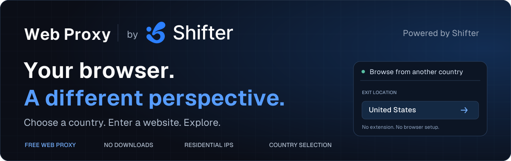

<p align="center">
  <a href="https://shifter.io/web-proxy?utm_source=github&amp;utm_medium=referral&amp;utm_campaign=web_proxy&amp;utm_content=readme_header">
    
  </a>
</p>

<h1 align="center">Free Web Proxy &amp; Online Proxy Site</h1>

<p align="center">
  Your browser. A different perspective.<br>
  <strong>No downloads. No browser setup. Residential proxy locations.</strong>
</p>

<p align="center">
  <a href="https://shifter.io/web-proxy?utm_source=github&amp;utm_medium=referral&amp;utm_campaign=web_proxy&amp;utm_content=readme_nav_proxy">Open Free Web Proxy</a> ·
  <a href="#how-to-use-the-online-proxy">How It Works</a> ·
  <a href="#embed-the-web-proxy">SDK Integration</a> ·
  <a href="https://ip-info.com/?utm_source=github&amp;utm_medium=referral&amp;utm_campaign=web_proxy&amp;utm_content=readme_nav_lookup">IP Lookup</a> ·
  <a href="https://shifter.io/?utm_source=github&amp;utm_medium=referral&amp;utm_campaign=web_proxy&amp;utm_content=readme_nav_shifter">Shifter</a>
</p>

**Shifter Web Proxy** is a free web proxy for opening websites through residential IPs, directly in your browser. Choose a country, enter a website address, and browse with familiar navigation controls. No extension, proxy client, or manual browser configuration is required.

Try the [Shifter Free Web Proxy](https://shifter.io/web-proxy?utm_source=github&utm_medium=referral&utm_campaign=web_proxy&utm_content=readme_intro), powered by [Shifter](https://shifter.io/?utm_source=github&utm_medium=referral&utm_campaign=web_proxy&utm_content=readme_intro_shifter). This repository contains the browsing backend, embeddable JavaScript SDK, and example proxy site interface. The companion [IP Info project](https://github.com/shifter-io/ip-info) provides the public IP lookup service and another website integration of the same SDK.

## Contents

- [Why Shifter Web Proxy?](#why-shifter-web-proxy)
- [How to use the online proxy](#how-to-use-the-online-proxy)
- [What can you use a proxy site for?](#what-can-you-use-a-proxy-site-for)
- [Check your proxy exit IP](#check-your-proxy-exit-ip)
- [About Shifter and its products](#about-shifter-and-its-products)
- [Embed the web proxy](#embed-the-web-proxy)
- [Self-hosting](#self-hosting)
- [Development](#development)
- [FAQ](#faq)
- [Contributing and support](#contributing-and-support)
- [License](#license)

## Why Shifter Web Proxy?

You want to see how your website looks from another country. A localized page shows different content, and you need a quick way to check it. Or you want to try a residential proxy before configuring one in your application.

Shifter Web Proxy puts those checks in a browser page: choose a location, open a URL, and explore. The online proxy handles the connection while you use an address bar and familiar browsing controls.

| Capability | What it helps you do |
| --- | --- |
| **Free browser-based proxy** | Open websites without installing software or changing your network settings. |
| **Country selection** | Preview websites through a residential exit in an available country. |
| **Residential proxy traffic** | Browse through Shifter's residential network from the proxy interface. |
| **Built-in navigation** | Move between pages with Back, Forward, Reload, and an address bar. |
| **Visible usage** | Check remaining browsing time and data in the toolbar. |
| **No visitor account** | Start browsing after verification, without creating an account. |
| **Embeddable JavaScript SDK** | Add the browsing experience to an authorized website with your own controls. |
| **Inspectable implementation** | Review the Rust services, session enforcement, and browser integration. |

The default free allowance is **up to 30 minutes and 100 MiB per day**. Website compatibility varies; the proxy does not guarantee access to every destination or support for every sign-in, video, or download flow.

## How to use the online proxy

1. Open the [Free Web Proxy](https://shifter.io/web-proxy?utm_source=github&utm_medium=referral&utm_campaign=web_proxy&utm_content=readme_proxy_start).
2. Choose a country from the location selector.
3. Enter an HTTP or HTTPS website address and select **Search**.
4. Complete verification, then browse with the built-in navigation controls.

Your remaining time and data appear in the toolbar. Changing country creates a fresh website session, so a destination may ask you to sign in again. Ending a session, reconnecting, or changing country does not reset the daily allowance.

The proxy covers websites opened inside its browsing interface. Other browser tabs and applications keep using their own connections.

## What can you use a proxy site for?

- **Website localization checks.** Review your public pages from another country and compare language, currency, or regional content.
- **Regional storefront previews.** Check how your own product pages and offers appear to visitors in another market.
- **Manual troubleshooting.** Compare a website's behavior through a different network exit when investigating a regional issue.
- **Trying residential proxies.** Explore a browser-based workflow before integrating proxy credentials into an application.

A country selection changes the requested proxy exit location. Websites may also use account settings, cookies, browser language, and their own location databases when deciding what to display.

For automated scraping, repeatable SEO monitoring, or larger data collection jobs, use the proxy and API products below.

## Check your proxy exit IP

Open [IP Info](https://ip-info.com/?utm_source=github&utm_medium=referral&utm_campaign=web_proxy&utm_content=readme_ip_lookup) **inside the proxy's address bar** to inspect the IP and location observed through the browsing session.

Compare the reported country with the location you selected. Opening IP Info directly in another tab checks that tab's connection instead. IP geolocation is approximate, and providers can disagree about a location.

Developers can use the [free IP geolocation and ASN API](https://ip-info.com/docs?utm_source=github&utm_medium=referral&utm_campaign=web_proxy&utm_content=readme_ip_docs) in their own proxy verification workflows. See [shifter-io/ip-info](https://github.com/shifter-io/ip-info) for HTTP examples, OpenAPI, and agent-readable documentation.

## About Shifter and its products

[Shifter](https://shifter.io/?utm_source=github&utm_medium=referral&utm_campaign=web_proxy&utm_content=readme_about_shifter) provides proxy infrastructure and web data APIs for developers and businesses. Shifter Web Proxy offers a free browser interface for quick checks; its proxy and API products support ongoing application workflows.

| Product | What it offers | Useful for |
| --- | --- | --- |
| [**Residential Proxies**](https://shifter.io/services/residential-proxies?utm_source=github&utm_medium=referral&utm_campaign=web_proxy&utm_content=readme_residential_proxies) | Residential proxy access with location targeting and session controls. | Regional data collection, localization checks, and web scraping. |
| [**ISP Proxies**](https://shifter.io/services/isp-proxies?utm_source=github&utm_medium=referral&utm_campaign=web_proxy&utm_content=readme_isp_proxies) | Proxy connections through ISP networks. | Workflows with specific network and location requirements. |
| [**Web Scraping API**](https://shifter.io/services/scraping-api?utm_source=github&utm_medium=referral&utm_campaign=web_proxy&utm_content=readme_scraping_api) | Managed retrieval of website content through an API. | Applications that need web data without operating the full fetching stack. |
| [**SERP API**](https://shifter.io/services/serp-api?utm_source=github&utm_medium=referral&utm_campaign=web_proxy&utm_content=readme_serp_api) | Search engine results delivered through an API. | SEO monitoring, keyword research, and search data workflows. |

[Explore Shifter](https://shifter.io/?utm_source=github&utm_medium=referral&utm_campaign=web_proxy&utm_content=readme_shifter_cta) · [View pricing](https://shifter.io/pricing?utm_source=github&utm_medium=referral&utm_campaign=web_proxy&utm_content=readme_pricing) · [Read the documentation](https://shifter.io/docs?utm_source=github&utm_medium=referral&utm_campaign=web_proxy&utm_content=readme_shifter_docs)

## Embed the web proxy

The shared SDK manages verification, session authorization, the destination iframe, and cleanup. Your website supplies the visible controls and subscribes to browsing state.

```html
<div id="proxy-view" style="height:70vh"></div>
<script src="https://proxy.example.net/sdk/v1/shifter-web-proxy.js"></script>
<script>
  const proxy = ShifterWebProxy.create({
    container: document.querySelector('#proxy-view')
  });

  proxy.subscribe(state => {
    // Render navigation controls, loading state, and remaining allowance.
  });

  proxy.init().catch(error => console.error(error.message));
  // After initialization, call from your Search handler and handle rejection:
  // proxy.search({ url: 'https://example.com', country: 'us' });
</script>
```

`proxy.example.net` is a placeholder for your configured runtime hostname. The website's exact origin must be authorized on the server; loading the script does not grant access. Live sessions require server-verified CAPTCHA and configured upstream credentials.

| Integration resource | Purpose |
| --- | --- |
| [SDK reference](docs/engineering.html#shared-sdk-integration) | Methods, state, error handling, and origin configuration. |
| [Minimal interface](web/control/minimal.html) | Example of a second interface using the same SDK. |
| [CAPTCHA configuration](docs/engineering.html#captcha-configuration) | Site keys, server verification, and development setup. |
| [Release and rollback](docs/engineering.html#release-and-rollback) | Versioned assets, compatibility, and loader updates. |

## Self-hosting

The application combines a Rust session API, Rust Wisp gateways, HAProxy, and private Redis. Scramjet runs in the browser; gateways forward destination traffic through Shifter. Upstream account credentials stay on the server.

**Requirements:** Docker with Compose and isolated bridge-network support, plus a browser with service workers, SharedWorkers, and WebAssembly. Live residential traffic also requires your own Shifter account and real CAPTCHA credentials. The repository does not include those services or secrets.

From a local checkout:

```sh
# Create ignored local configuration; preserve existing files.
sh scripts/configure.sh

# Build and start the synthetic development stack.
sh scripts/stack.sh mock
```

Open **http://localhost:8080** to inspect the interface. The runtime uses port 8081. Use `localhost` consistently because authorization checks exact origins.

Mock mode uses synthetic destinations without paid upstream traffic. Its successful verification flows require challenge records supplied by the automated tests; arbitrary CAPTCHA responses are not accepted. Use the [SDK test runner](docs/engineering.html#shared-sdk-validation) for complete synthetic checks, or follow the [real-CAPTCHA setup](docs/engineering.html#captcha-configuration) for manual browsing development.

```sh
# Stop the local stack while retaining its Redis volume.
sh scripts/stack.sh down
```

### Configuration and deployment

| Resource | Purpose |
| --- | --- |
| [Local environment example](.env.example) | Development configuration and allowance defaults. |
| [Live Shifter setup](docs/engineering.html#using-a-real-shifter-account) | Private upstream credential files and live development mode. |
| [Production environment example](deploy/production.example.env) | Runtime hostname, allowed website origins, and secret mounts. |
| [HTTPS/WSS deployment guide](docs/engineering.html#httpswss-deployment) | Production ingress, certificates, and private state connectivity. |
| [Production acceptance checklist](docs/engineering.html#production-work-still-required) | Remaining real-domain, CAPTCHA, and browser validation work. |

Redis must stay private in every region, without public endpoints or published ports. Production policy requires named ACL users and verified TLS. Authorization or quota-storage failures must deny access. Keep credentials and active deployment configuration in ignored local files or secret storage.

## Development

Host-side checks use Node.js 24 and Rust compatible with the pinned Rust 1.94.1 build toolchain. Docker includes the build toolchains; Python 3 generates the offline documentation.

```sh
npm ci --ignore-scripts
npm test
cargo test --locked
node scripts/build-sdk.mjs
python3 scripts/render-readme.py
```

SDK 1.0.4 detects an unresponsive browsing runtime and attempts bounded recovery within the existing session. The current runtime uses libcurl transport, bundles its domain suffix data, and retries an interrupted successful script or stylesheet response once. Proxied pages use their normal rendering fallback instead of native View Transitions to avoid a reproduced Chrome compositor crash. The gateway queues short connection bursts and flushes upload flow-control credits. Existing deployment overrides must be updated separately.

The [engineering guide](docs/engineering.html) covers architecture, API contracts, session limits, isolation, and troubleshooting. See [testing and validation](docs/engineering.html#testing-and-validation) for container integration checks and bounded live smoke tests.

| Directory | Contents |
| --- | --- |
| `src/` | Rust API, gateways, authorization, and destination policy. |
| `web/control/` | Proxy landing page and browsing controls. |
| `web/runtime/` | Isolated browser runtime and service worker. |
| `web/sdk/` | SDK source, immutable releases, and public loader. |
| `scripts/` | Local setup, builds, and documentation generators. |
| `tests/` | Synthetic fixtures, integration checks, and live smoke tests. |
| `deploy/` | Portable deployment examples. |
| `docs/` | Standalone HTML documentation and the README banner. |

The banner uses the site's Geist font and Shifter logo. To regenerate it, install the optional `fonttools` and `brotli` Python packages and run `python3 scripts/generate-readme-header.py`. Run `python3 scripts/render-readme.py` afterward to refresh the [offline README](docs/readme.html), which embeds the banner and opens without a server or external assets.

## FAQ

### Is this web proxy free?

The visitor interface provides free browsing with a default allowance of up to 30 minutes and 100 MiB per day. No visitor account is required; verification protects access. Self-hosting still requires infrastructure and a Shifter account for live residential traffic.

### What is an online proxy site?

An online proxy site lets you enter a website address and browse through an intermediary from a page in your browser. Shifter Web Proxy forwards destination requests through residential proxies in the selected country.

### Do I need an extension or a proxy list?

No. Visitors use the proxy site directly in a supported browser. There is no proxy list to import, extension to install, or browser proxy setting to change.

### Is a web proxy the same as a VPN?

No. The web proxy handles pages opened inside its interface. It does not route traffic from your entire device or other applications.

### Can this proxy unblock every website?

No. A different network exit can change how a website responds, but destinations may restrict proxies, require additional verification, or use unsupported browser features. Availability, sign-in flows, streaming, and downloads vary by website.

### Does the web proxy make me anonymous?

It changes the network exit used for proxied website requests. It does not guarantee anonymity: a website can still recognize accounts you sign into and information you submit. Use the tool with that distinction in mind.

### Does changing country reset the free allowance?

No. Country changes create a fresh website session while preserving the existing time and data allowance. Stopping or reconnecting also preserves usage.

## Contributing and support

Improvements to browser compatibility, SDK examples, documentation, and tests are welcome. Include reproduction steps and expected behavior with a bug report, and run the relevant checks before submitting a pull request.

For service questions, contact [hi@shifter.io](mailto:hi@shifter.io) or consult the [Shifter documentation](https://shifter.io/docs?utm_source=github&utm_medium=referral&utm_campaign=web_proxy&utm_content=readme_support). Keep credentials, connection tickets, and private browsing information out of reports.

If the tool is useful to you, share the [Free Web Proxy](https://shifter.io/web-proxy?utm_source=github&utm_medium=referral&utm_campaign=web_proxy&utm_content=readme_footer) or star this repository to help others discover it.

## License

Project source is released under the [MIT License](LICENSE). Third-party dependencies, fonts, and assets retain their own licenses, including applicable AGPL obligations for proxy components. Shifter branding retains its respective rights.
